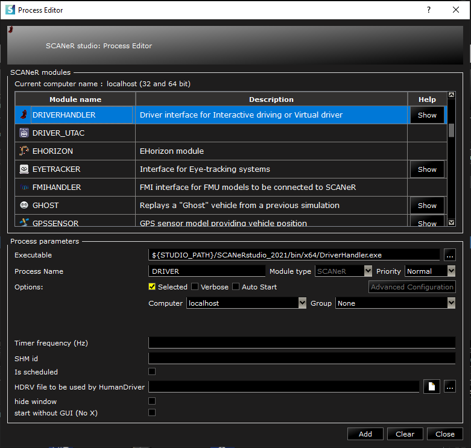
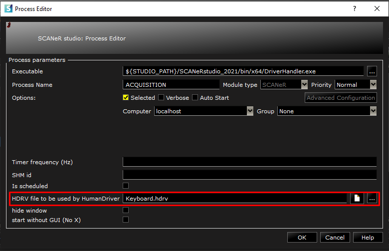
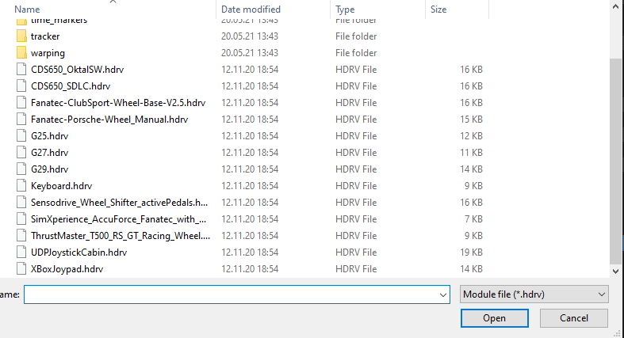
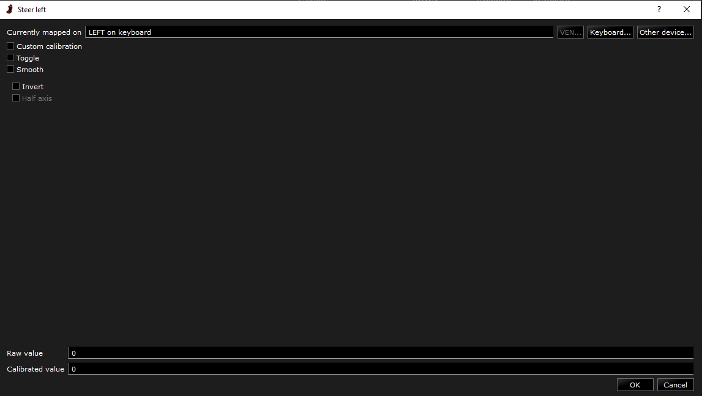
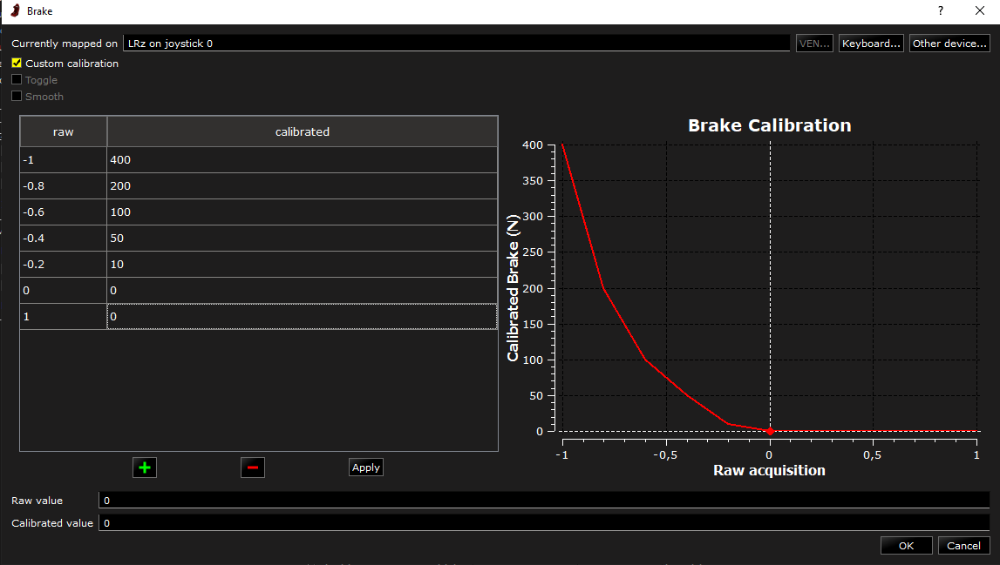
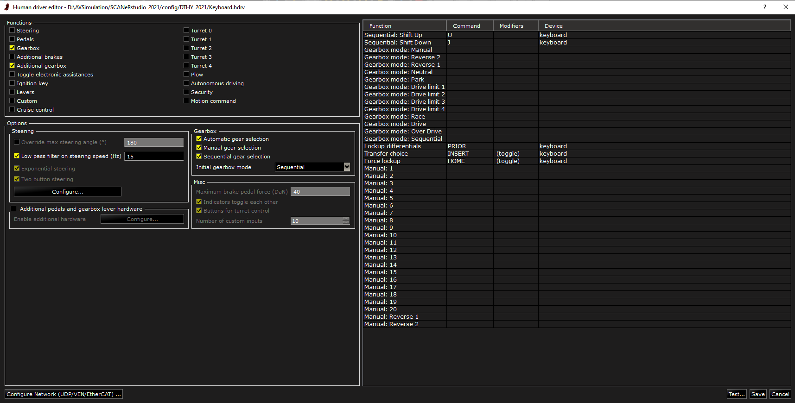

# How to? Configure driver's input

SCANeR can be deployed on many different platforms (workstation, driving simulator, cloud, etc.). SCANeR can be used with autonomous driving as well as with a human driver in the loop. Having an accurate acquisition of the driver's input is very important in order to have a more immersive driving experience.

This guide explains how to configure driver's input in SCANeR studio.
- Step 1. Add the driver's acquisition module to your SCANeR workspace
- Step 2. Select the correct configuration file 
- Step 3. Modify the mapping 
  - Step 3.1 Steering wheel
  - Step 3.2 Pedals
  - Step 3.3 Gearbox

## Step 1 Add the driver's acquisition module to your SCANeR workspace
1.1 Open SCANeR studio on your system and go to `CONFIGURATION/Configuration Manager...`.

1.2 Check the configuration contains Acquisition module. You can skip step 1.3 if it contains the Acquisition module.

>Acquisition is the generic name for the module that will be used to drive the interactive vehicle.

1.3 Add the Acquisition module to your SCANeR Workspace.
 - Click on `Add Process`, select `DRIVERHANDLER` module from the `Process Editor` list, click on `Add` and `Close`

You have now the Acquisition module in your configuration ! Let's move to step 2.

## Step 2 Driver acquisition configuration file 
AVSimulation provides several driver acquisition configuration files. These are preconfigured in order to work with standard systems (Logitech, Fanatec, Sensodrive steering wheels, etc.). The user is able to use these configuration files or tune them to fits its need.

1. In order to change the configuration file, go to `CONFIGURATION/Configuration Manager...`.

2. Select Acquisition module in your configuration and click on `Edit Process`.

3. You can see a parameter `HDRV file to be used by HumanDriver`- This parameter specify the mapping file between the driver's input and the driver's command in SCANeR. 

4. Click on  `...`to see the available files provided by AVSimulation. These configuration files are ready to use for standard systems. 

If your system is not on the list or if you want to customize the mapping, check out step 3 !

AVSimulation can also help you configure and tune your acquisition system 😀.

## Step 3 Modify the mapping
In this chapter we will see how to modify the mappings for the most common driver's input (Steering wheel, Pedals and Gearbox).
1. In order to change the configuration file, go to `CONFIGURATION/Configuration Manager...`.

2. Select Acquisition module in your configuration and click on `Edit Process`.

3. In the Process Editor, click on the file icon next to .hdrv file name.

4. In the Human driver editor there are four differents areas.
 - Functions group in upper left - This area is used to select the driving main functions (such as steering, pedals, ignition key…) that will be controlled by the HumanDriver. The functions that are not checked can be done by another acquisition module.
 - Function mapping in the right - This area is a table containing the mapping of each function of the SCANeR vehicle to a command from a hardware system.
 - Options in the middle left - This area will enable more active controls for the operator to choose more parameters related to the selected function.
 - Configure network in lower left corner - It is also possible to retrieve acquisition through UDP, VEN or EtherCAT Communication.

5. Modify the mapping.
  - Steering wheel

There are 2 functions for steering wheel (Steer left and Steer right).
To change the mapping, double click on Steer left (or Steer right), you can then click on `other device...` or `Keyboard` and press the key you want to use to steer left
 
 
  - Pedals

You can repeat the step above for Pedals functions (Brake, Gas, Handbrake and Clutch).
For Brake, Gas and Clutch, it is possible to use the `smooth` option to have a value that changes smoothly from 0 to 1. `Custom calibration` can be used to use a custom curve to create a non linear mapping between the command and the input. A good calibration allows a better feeling and immersion for the driver.

  - Gearbox

In SCANeR you can choose whether you drive an antomatic gearbox, manual gearbox or sequential gearbox in the `Options` area. Once you have chosen, you can map buttons in `Function mapping` area to change the mode (e.g. Switch between Automatic and Manual) or to change the gearbox mode (e.g. from Drive to Park for an automatic gearbox).

## Step 4 Test the new mapping

Before finishing, you can test the new mapping by clicking on `Test...` in the bottom right of the `Human driver editor` window.

Once you are happy with the settings, click on `Save`.

Congrats ! Have fun with your own steering wheel and pedals configuration ! 🚗

