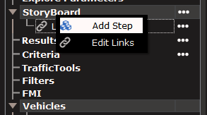
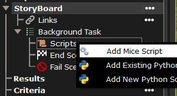
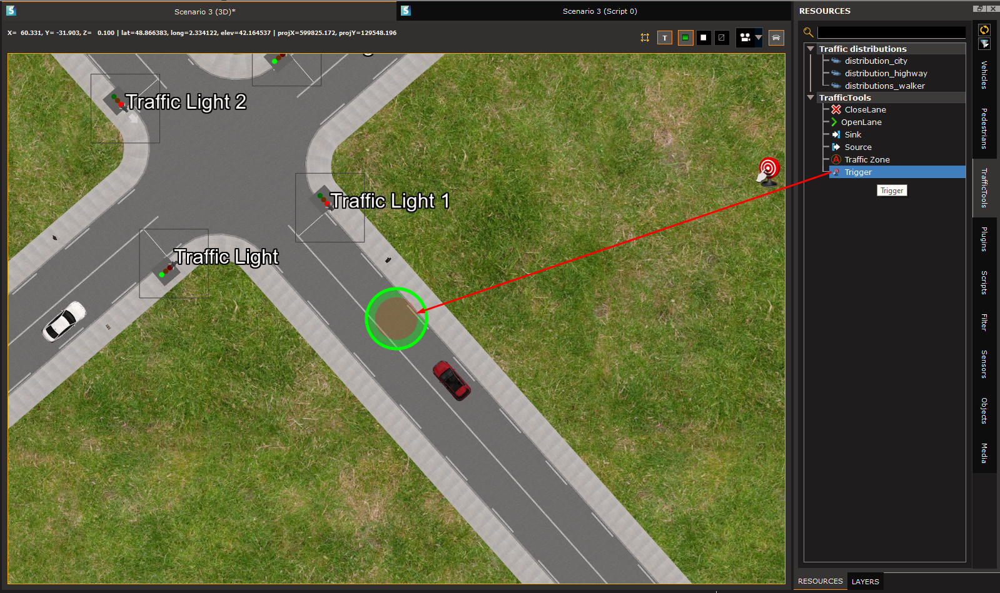
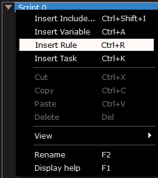
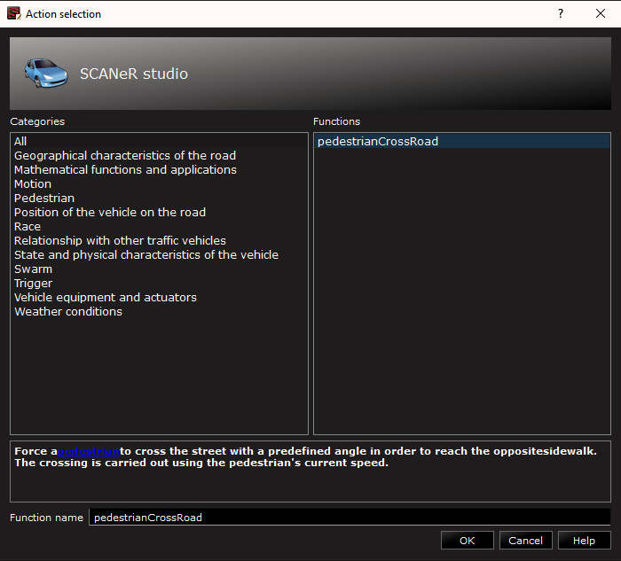

# How to? Create a MICE script

In SCANeR studio, you can enhance every `Scenario` by scripting the events that occur between the different `Actors` . There are many ways to script theses events, but in this article, we'll be scripting the behavior of a pedestrian, so he crosses the road when the EGO Vehicle hits a `Trigger`.

Step 1. Create the script and prepare the scenario

Step 2. Write the script

Let's jump into the guide!

## Step 1. Create the script and prepare the scenario

1. First of all, we have to add the script to our `Scenario`. To do this, right click on `StoryBoard` and select `Add Step`. Then, in the `Step` you have just created, right click on `Scripts` and select `Add MICE script`.

    

2. Before editing the script, we first have to place the `Trigger` used to make the pedestrian cross the road. To do this, go in the `TrafficTools` tab in the `Resources` window, and drag and drop the `Trigger` object in front of the EGO vehicle.

   

## Step 2. Write the script

1. To edit the script, double click on it, and the script editing interface opens. To start writing our script, we need to add a new `Rule`. To do this, right click on `Script 0` and select `Insert Rule`.

   

2. Then you need to add a new condition to your newly created `Rule`. Right click on the rule, and select `Insert Condition...`.

   

   You will be prompted to choose which condition you want to add. In our case, we need the `isTriggeredByVehicle` function as a condition. Just type the function you are looking for in the bottom of the window and select it in the right panel.

   

   > Keep in mind that you can always look for help in the scripting documentation by clicking on `HELP -> Scripting Help`

   After clicking on `OK` a new window will appear in order to parameter the function correctly. In our case, the trigger named `Trigger` has to be hit by the vehicle called `[0] SmallFamilyCar`.

   

3. After your condition is setup correctly, we need to select the `Action` that will be executed when the condition is met. To do this, right click on the `Rule` and select `Insert THEN action...`. 

   

   As for the `Condition` you have setup previously, you will be asked to select the function you want to execute when the condition is met. In this case, we want to make the pedestrian in front of the car cross the road. The function to do this is `pedestrianCrossRoad`.

   

   In the setup window, we want the pedestrian called `Man_Allseasons_03` (which is the one in front of my EGO vehicle in my case) to cross the road. We just have to change this parameter.

   

4. Your MICE script is now operational! It should look like this : 

   

   You can now save your scenario and execute it. If you need help for the execution, check out our article about it: [How to run a SCANeR simulation: the good practices](../HT_Run_a_simulation_good_practices/HT_Run_a_simulation_good_practices.md)

   The execution of this scripted scenario should look like this: