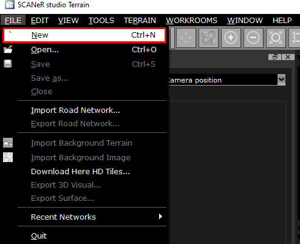
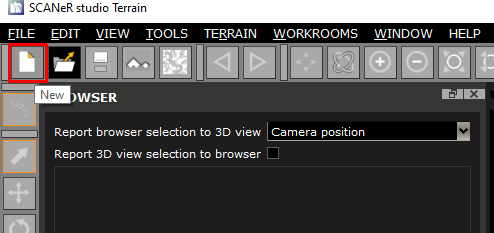

# How to? Create a simple environment from scratch

In SCANeR studio, the simulation is composed of `actors` (light vehicles, trucks, buses, motorbikes, pedestrians, etc...) performing actions according to a `scenario` that has been created by the user. This `scenario` has to take place in an environement we call the `terrain` of the `scenario`. There are default environments present in SCANeR studio that you can use, but you can also create your own.

> Note: If you already have specific environments, you can import them in SCANeR studio, or we can help you import them. We also propose complete and realistic environments as the [N118 around Paris](https://www.avsimulation.com/a86-n118/) or [the Europe 2.0 environment](https://www.avsimulation.com/europe-2-0/). If you are interested in such services, feel free to contact us.

A `terrain` is composed of the logical road network, used by the actors to take their own decision (thanks to SCANeR Traffic A.I.), and of a 3D representation of the road, the intersections and the decorative elements.

In this guide, I will explain how to create a new environment composed of a simple intersection with traffic lights, and use it in the simulation.

- Step 1. Start TERRAIN mode and create a new `terrain`
- Step 2. Create the road network
- Step 3.Export the 3D

After following these simple steps, you will be able to create any `terrain` you want, and enhance your experiments 😉.

Let's jump into the guide!

## Step 1. Start TERRAIN mode and create a new terrain

1. When you start SCANeR studio, it will start in `SIMULATION` mode by default. To switch to the `TERRAIN` mode, just click on the `TERRAIN` button in the top menu. A separate window will open, showing the `TERRAIN` mode UI.
   
   
   
2. Once the TERRAIN mode is loaded, you can click on `File -> New` or simply click on the Blank Page icon to create a new `terrain`
   
    

## Step 2. Create the road network and the 3D

1. To create a new road, simply click on the `Insert Segment` tool on the left side of the window, and click and drag your mouse to create the road you want in the main window. After you have drawn the tro segments composing your intersection, select one of them, rightclick and select `Detect Intersection`. You now have an intersetion between two roads 👍. 
<video src="https://user-images.githubusercontent.com/22998298/127977584-23603bda-3850-4720-bc1d-3eef40cb08a5.mp4" controls="controls" style="max-width: 730px;"></video> 
   > Note: You can change the profile of the road, which means the number of lanes and their disposition, through the `PROFILE` workroom, but that's for another guide 😉.

2. In this step we will add realism to the terrain we just created by adding traffic lights. To add a traffic light, you have to select the `Select` tool. Then select the track you want to add a traffic light on by clicking on it. Click on `Insert Signal` and in the window that appears you have to check `Traffic Light`. In this first traffic light, we will create the Traffic Light group in order to synchronize all the traffic lights. Click on the dropdown menu and select `New...`. Name your group as you wish and select it for the current Traffic Light. When your traffic light is configured just click `OK`. Your Traffic light is now added to your Terrain, you just have to place it in the right spot on the sidewalk by dragging it. Repeat this step for as many traffic light you want in your Terrain. In mine, I chose to have four of them. In the video below, you can see how I created them. 
<video src="https://user-images.githubusercontent.com/22998298/127977612-ba466420-2367-4e43-b754-901f318521f5.mp4" controls="controls" style="max-width: 730px;"></video> 
3. Now, let's synchronize our Traffic Lights. To do this, open the configuration of one of your traffic lights by double clicking on it, and in the `Animation` category click on `Edit...`. A new window appears where you can configure the color of your lights and the amount of time between every step. In order to change the starting state of a Traffic Light, just click on the `On`, `Off` or `Blink` button in front of the color you want to change. In my case, I want the Traffic Lights named `Traffic Light` and `Traffic Light 2` to start at the `Red` state, so I switched the first and last state of these two traffic lights, as you can see in the video below. 
<video src="https://user-images.githubusercontent.com/22998298/127977645-df7f1664-7ed8-40ae-a5db-6cab2a4a9e0f.mp4" controls="controls" style="max-width: 730px;"></video> 

## Step 3. Export the 3D

1. In order to be able to see the environment in the simulation, we need to generate the 3D file representing it. But before doing this, let's make sure our Traffic Lights are oriented correctly. You can switch to the `Perspective View` by clicking on the `Camera` button on the top right corner and by selecting `Perspective View`.

   You can now see how the traffic lights are oriented and correct them if needed. In my case, the only one that was not oriented correctly was the one named `Traffic Light 2`. To correct the orientation just select the Traffic Light and in the `SELECTION` window search for `Heading`, then change its angle. 

<video src="https://user-images.githubusercontent.com/22998298/127978181-6b1fe79d-f04c-4110-99da-50fae408c954.mp4" controls="controls" style="max-width: 730px;"></video> 

2. Once the 3D representation is correct, we need to generate it. To do this, first save the terrain you just created by clicking on `File -> Save` and name it as you wish. Then click on `File -> Export 3D Visual` to start the 3D generation. Choose the location and the name of the file. An interface will appear allowing you to choose the objects you want to export. Simply check the object you want in the 3D and uncheck the not needed.

Congratulations you have created your own `Terrain`! Well done! 👍

