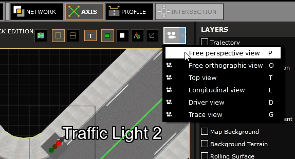

# How to create a road network from scratch

In SCANeR, the simulation is composed of `actors` performing actions according to a `scenario` that has been created by the user. This `scenario` takes place in an environement we call the `terrain` of the `scenario`. There are default environments present in SCANeR default data set that you can use, but you can also create your own.

> Note: If you already have specific environments, you can directly import these in SCANeR, or we can help you to replicate these as a service on demand. We also offer off-the-shelf complete and realistic environments such as the [N118 around Paris](https://www.avsimulation.com/a86-n118/) or [the Europe 2.0 environment](https://www.avsimulation.com/europe-2-0/). More information on: [https://www.avsimulation.com/content-creation/](https://www.avsimulation.com/content-creation/).

A `terrain` is composed of road logical content, used by the actors to make their own decisions (thanks to SCANeR Traffic A.I.), and of a 3D representation of the roads, intersections and decorative elements.

In this guide, I will explain how to create a new environment composed of a simple intersection with traffic lights, to be used in your custom simulation.

- Step 1. Start TERRAIN mode and create a new `terrain`
- Step 2. Create the road network
- Step 3. Export the 3D

After following these simple steps, you will be able to create any `terrain` you want, and enhance your experiments 😉.

Let's jump into the guide!

## Step 1. Start TERRAIN mode and create a new terrain file

1. When you start SCANeR, it will start in `SIMULATION` mode by default. To switch to the `TERRAIN` mode, just click on the `TERRAIN` button in the top menu. A separate GUI will open, showing the `TERRAIN` mode UI.
   
   
   
2. Once TERRAIN mode is loaded you will see a toolbar, which has the `Home` tab selected by default. You can click the `New` button to open a new terrain project.
   
    
   

## Step 2. Create the road network and the 3D representation
1. Click on the `Roads` tab to bring up the menu for inserting segments. Here you can click on any of the buttons in the `Insert Road Curves` sub-menu to select the road type, and then drag your mouse in the editor to lay down a segment. If you create two intersecting segments, the `Detect` button in the `Intersection` sub-menu becomes available. Click this button to create an intersection at the point where the two segments cross. 
<video src="https://user-images.githubusercontent.com/22998298/127977584-23603bda-3850-4720-bc1d-3eef40cb08a5.mp4" controls="controls" style="max-width: 730px;"></video> 

<video src="https://github.com/AVSimulation/SCANeR-Quick-Starts/blob/Published/Pages/HT_Create_a_simple_environment_from_scratch/assets/detect_intersection.mp4" controls="controls" style="max-width: 730px;"></video> 

   >Note: SCANeR veterans will recall it was necessary to enable to `Intersection 3D Generation` layer to see an intersection. New in version 2023, this layer is enabled by default while in the `Roads` tab.

2. In this step we will add realism to the terrain we just created by adding traffic lights. Using the `Select` tool, left click the axis a road(in this case the green line) to select it, then right click to bring up the menu. Click `Insert Signal` to open the `Edit Signals` menu.

   
   
   In this menu, first select `Traffic Light` to start editing your signal. At the bottom of the `Signal Options` section, click the drop down menu in the `Traffic Light Group`, and add a name for your group. This group will be associated with all of the signals in this intersection to ensure their animation and logical instructions for traffic are in sync.

   
 
   Click `OK` when you are done configuring and you will see the traffic light has been placed on the track. Now you just have drag and drop it on the right spot on the sidewalk. Repeat this step for as many traffic lights as you want in your Terrain. I recommend four, one for each road in your intersection. Be sure to add them all to the same animation group!
<!-- <video src="https://user-images.githubusercontent.com/22998298/127977612-ba466420-2367-4e43-b754-901f318521f5.mp4" controls="controls" style="max-width: 730px;"></video> -->
   >Tip: it's always a good idea to name your signals something which clearly denotes their location or purpose. Here, I will attach cardinal directions to my traffic light names to easily understand where they are on my intersection. This will help me when editing the signal animations in the next step

3. Now let's synchronize our Traffic Lights. Double click on one of your trafic lights to open the menu, and then click the `Edit` button in the `Animation` section. A new GUI appears where you can configure the color of your lights and the amount of time between every step. Click the cells with lights in them to change thei state between `on`, `off`, or `blink`. Change the time each state is active by clicking on the time at the top of the light's table. In my case, I want the east and west groups to be in sync with each other, and the north and south lights will have a corresponding pattern. You can use the slider at the bottom to preview the animation and confirm the state of each light at specific points in your cycle.

   

<!-- <video src="https://user-images.githubusercontent.com/22998298/127977645-df7f1664-7ed8-40ae-a5db-6cab2a4a9e0f.mp4" controls="controls" style="max-width: 730px;"></video> -->

## Step 3. Export the 3D

1. In order to see the environment in the simulation, we need to generate the 3D file representing it. But before doing this, let's make sure our Traffic Lights are oriented correctly. You can switch to the `Perspective View` by clicking on the `Camera` button on the top right corner and by selecting `Perspective View`.

   You can now see how the traffic lights are oriented and correct them if needed. In my case, the only one that was not oriented correctly was the one named `Traffic Light 2`. To correct the orientation just select the Traffic Light and in the `SELECTION` window search for `Heading`, then change its angle. 

<!-- <video src="https://user-images.githubusercontent.com/22998298/127978181-6b1fe79d-f04c-4110-99da-50fae408c954.mp4" controls="controls" style="max-width: 730px;"></video> -->

3. Once the 3D representation is correct, we need to generate the 3D file. To do this, first save the terrain you just created by clicking on `File\Save` and name it as you wish. Then click on `File\Export 3D Visual` to start the 3D generation. Choose the location and the name of the file. An interface will appear allowing you to choose the objects you want to export. Simply check the objects you want in the 3D and uncheck those not needed.

> Note: In this menu, be sure NOT to check the box for `3D Objects`. In the simulation, 3D Objects are handled by a different module, and exporting them in the Terrain will cause them to duplicate and overlap.

Congratulations you have created your own `Terrain`! Well done! 👍
