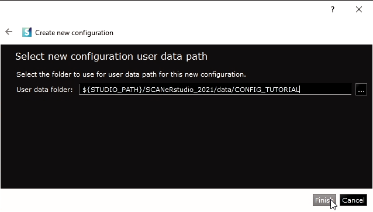

# How to create a new workspace

In SCANeR studio, the different workspaces you can have are called `Configurations`.  In the context of simulation, these different `Configurations` will help you organize your data and simulation parameters between your different projects. For instance, if you run the simulation on a Workstation, the running modules will differ from those used in a large Simulator environment. This is why you can use different `Configurations` in order to save your parameters and data according to the use case.

This guide will explain how to create a specific `Configuration` in SCANeR studio and switch to it.

- Step 1. Open the Configuration Manager
- Step 2. Create a new Configuration
- Step 3. Switch to the newly created Configuration

There is a `DEFAULT` configuration that is installed automatically with SCANeR.

> Note: We recommend not to alter this `DEFAULT` configuration, as it is the configuration that will be used to create new custom configurations.

Each `Configuration` has specific settings and data that will be used when it is slected. This helps you setup the environment according to the experiments you want to conduct. For instance, the Configuration you will use to run a simulator run will not be composed of the same modules as the Configuration used on your workstation. In this case, having two separate configurations helps you differentiate the configuration files, the launched modules and the data files used in the simulation.

Enough chatter, let's jump into the guide! 😁

## Step 1. Open the Configuration Manager

Click on `"CONFIGURATION" -> "Configuration Manager..."` and a window allowing you to manage you different Configurations will appear.

You can see your different available configurations here and switch between them.

> Tip: When a module has its "Selected" checkbox ticked, it'll start when the supervisor clicks on the run simulator button. When a module has its "Auto Start" checkbox ticked, it'll automatically start when the configuration is loaded (click on OK).

## Step 2. Create a new Configuration

1.  To create a new configuration you have to click on the "New Configuration" button located in the bottom left of  the Configuration Manager. The window that appears is the Configuration Creation Wizard. The first thing you have to choose is the source configuration, meaning the settings files that will be copied to create your new configuration. If you don't have a specific configuration yet, you can use the `DEFAULT` configuration as a source.

2.  After that, you can name the configuration and choose its path. If you do not modify the path, it will be : 
    - `<SCANeR Install Path>\config\<Your_Config_Name>\`.

3.  The last thing you have to choose is the path of the data for your configuration. If you do not modify it, the path will be :
    - `<SCANeR Install Path>\data\<Your_Config_Name>\`.

## Step 3. Switch to your Configuration

You can now select your newly created Configuration in the list and click on "Apply" in the bottom right corner of the window.

If you need more help about this step, you can check the guide about this topic [here](../HT_Change_work_environment/HT_Change_work_environment.md).

**Congratulations! You now have your own custom Configuration!**
