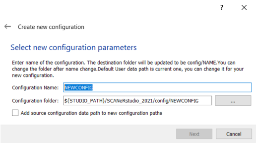
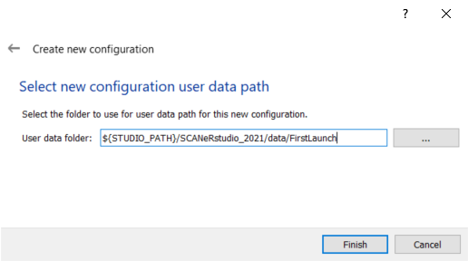

# How to launch SCANeR for the first time

This guide will explain how to launch and setup your SCANeR studio for the very first time.

* **Step 1.** Launch SCANeR studio
* **Step 2.** Create a new `Configuration`
* **Step 3.** SCANeR is ready to use!

<iframe width="560" height="315" src="https://www.youtube.com/embed/pnq0vsR74Xw?start=48" title="YouTube video player" frameborder="0" allow="accelerometer; autoplay; clipboard-write; encrypted-media; gyroscope; picture-in-picture" allowfullscreen></iframe>

## Step 1. Run SCANeR studio

After installing SCANeR studio, double-click on the shortcut available on your desktop.

If you're unsure how to install, everything you need is here: [Install SCANeR.](../HT_Install_SCANeR_studio/HT_Install_SCANeR_studio.md) 😊

Once launched, a GUI will appear asking you to select a `Configuration` to begin.

In order to avoid modifying the DEFAULT `Configuration`, which will be used as a base and back-up for many future situations, you will have to create a new `Configuration`.

> In SCANeR studio, the different workspaces you can use are called `Configurations`. In the context of simulation, these different `Configurations` will help you organize your data and simulation parameters between your different projects. For instance, if you run simulations on a Workstation, the running modules will differ from the ones used in a large Simulator environment. Through the use of different `Configurations`, you can save your parameters and data according to each use case.

## Step 2. Create a new `Configuration`

A new `Configuration` is a copy of an existing one. The DEFAULT `Configuration` is used as a basis for creating your first `Configuration`.

Here, your only choice will be the DEFAULT `Configuration`. Click on "Next".

Now choose a name for your new `Configuration`. It can be useful to name your `Configurations` according to their purpose. For example, here I'll call mine FirstLaunch.

After naming your `Configuration`, Click on "Next".

The path to the data folder of your `Configuration` will be found automatically with the data from other `Configurations` folders. Click on "Finish".

## Step 3. SCANeR is ready to use!

You're all set! You can now run your first simulation.

<<<<<<< HEAD
If you need help to navigate through the basic interfaces of SCANeR studio, read this: [Navigate the user interface](../HT_Navigate/HT_Navigate.md) 😊
=======
If you need help navigating through the basic interfaces of SCANeR studio, read this: [Navigate the user interface](../HT_Navigate/HT_Navigate.md) 😊

:arrow_right: [Navigate the user interface](../HT_Navigate/HT_Navigate.md)
>>>>>>> f462757dcede1ba53fcb1d6b6c96f9bf9a78dc7d
