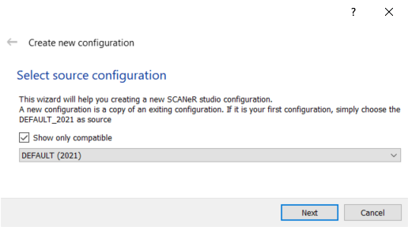

# HOW TO? Launch SCANeR studio for the first time.

This guide explains how to launch and setup your SCANeR studio for the very first time.

**Step 1.** Launch SCANeR studio

**Step 2.** Create a new configuration

**Step 3.** Enter the software

### Step 1. Run SCANeR studio

Once launched, a window will appear asking you to select a configuration to begin.

In order not to modify the DEFAULT configuration, which will be used as a base and back-up for many future situations, you will have to create a new configuration.

### Step 2. Create a new configuration

A new configuration is a copy of an existing one. As explained before, the DEFAULT configuration is used as a basis for creating other configurations.

Here, your only choice will be the DEFAULT configuration. Click on "Next".

Now choose a name for your new configuration.

The path to the folder of your configuration will be found by default with the other folders of the other configurations. Click on "Next".

The path to the data folder of your configuration will also be found by default with the other data folders of other configurations. Click on "Finish".

### Step 3. Enter the software

You're all set! You can now run your first simulations.

If you need help to navigate through the basic interfaces of SCANeR studio, read this: [How to? Navigate in SCANeR studio.](https://github.com/AVSGuillaume/Samples-Pack/blob/Pages/Pages/HT_Navigate/HT_Navigate.md) 😊

