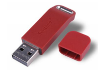

:arrow_left: [How to install SCANeR studio](../HT_Install_SCANeR_studio/HT_Install_SCANeR_studio.md)

# How to install your SCANeR license

You recently purchased a new SCANeR license. 🥳

AVSimulation provides 2 kinds of licenses:
- Nomadic licenses - This format is dedicated to the people who need to move their license from one computer to another. It may be the case if the user navigates between his desktop and test tracks. In this case, it is important not to lose or damage the dongle.
- Fixed licenses - This is a type of license to choose if you want to install a license on computer or if you want to install multiple licenses on a computer that will act as a token server.

> More information on SCANeR details can be found in the [software catalog](https://www.avsimulation.com/pack-foundation/).

This guide will explain how to install [Nomadic licenses](#nomadic-licenses) and [Fixed licenses](#fixed-licenses).

## Nomadic Licenses
This chapter explains how to install a nomadic SCANeR license. The license is distributed on a physical dongle.

- Step 1. Receive the physical USB dongle
- Step 2. Plug the USB dongle to the computer

### Step 1. Receive the physical USB dongle
After the receipt of the Purchase Order (PO), AVSimulation will send you a physical USB containing your nomadic SCANeR license. Once you received it, please sign the attached acknowledge receipt and send it back to [support-scaner](mailto:support-scaner@avsimulation.fr).

### Step 2. Plug the USB dongle to the computer
You can directly plug the USB dongle to a computer with SCANeR installed. The license is already installed in the dongle.
> **Note:** The driver for the USB dongle is automatically installed with SCANeR. Make sure to have SCANeR installed on the system before connecting the USB Dongle.

Congratulations! 💪  
You can enjoy your new SCANeR products! 😊  
[Start using SCANeR studio](../HT_FirstLaunch/HT_FirstLaunch.md)

> **Note:** AVSimulation will provide you with a temporary license on the physical dongle while payment is under process. Once payment is done, AVSimulation will provide you with an [license update](../HT_Update_SCANeR_license/Update_SCANeR_license.md).

## Fixed Licenses

This chapter explains how to install a fixed SCANeR license. This license is distributed in a file.
- Step 1. Install SCANeR studio
- Step 2. Generate C2V file
- Step 3. Install the license

> **Important notes:**  
> Fixed license cannot be moved once installed. Each step below should be done on the computer that will run SCANeR.  
> Administrator rights are required for the installation of the license. 

### Step 1. Install SCANeR studio

The installation of SCANeR studio is described in [SCANeR studio installation](../HT_Install_SCANeR_studio/HT_Install_SCANeR_studio.md)

### Step 2. Generate C2V file

#### Step 2.1. Launch the tool
Find in `%STUDIO_PATH%/third party/` the service `RUS_QAKOG.exe`. You must launch it as **Administrator**
#### Step 2.2. Create your C2V file
1. Go to tab `Collect Key Status Information`
2. Select the option `installation of new protection key`
3. Click on `Collect information` button

#### Step 2.3. Share it!
Once the C2V is generated, rename it (e.g. `Your_Company.C2V`) and send it to [support-scaner](mailto:support-scaner@avsimulation.fr).
AVSimulation will produce the license based on the collected information and send to you as
soon as possible the license file.

>**Note:**
>C2V means Client to Vendor. 
>On the other hand, V2C means Vendor to Client.

### Step 3. Install the license

Once you received the license file (V2C file), the last step is to [update the license](../HT_Update_SCANeR_license/Update_SCANeR_license.md).

Congratulations! 💪  
Your license is now installed, you can enjoy your new SCANeR products! 😊  
[Start using SCANeR studio](../HT_FirstLaunch/HT_FirstLaunch.md)

:arrow_right: [How to update the license](../HT_Update_SCANeR_license/Update_SCANeR_license.md)  
:arrow_right: [Start using SCANeR studio](../HT_FirstLaunch/HT_FirstLaunch.md)
