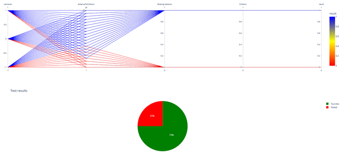

# How to analyze your results

Once the simulations have been executed, you’ll get all of the test case results (60 in our case).  
To analyze test cases individually, you can use SCANeR studio's standard “dashboard” (Analyzing Tools for familiar users 😉).  
It enables you to trace synchronized graphs, camera views, sounds, export data to CSV, etc.  
To process Big Data, a traditional “dashboard” is not enough. You’ll need apps giving you a point-&-click interface to expand the possibilities.  
As any user, test case, IT infrastructure are unique, we offer the possibility to deploy and scale SCANeR results within your favorite apps, so scientists and engineers can put complex analytics in the hands of business decision makers and operators.  
For this SCANeR application we display SCANeR results within a point-&-click web interface to models written in Python.  

> Note: a standard installation of Python is required as it uses specific libraries, namely dash, plotly, pandas.



We deliver the 60 SCANeR results with this sample, so all you just have to enjoy them 😊

## How to use it in Windows

* Double click on `.\bin\x64\analytics\AEB\resultsAnalysis.bat`  

Principle: it generates a csv file named `results.csv`, which is filled out thanks to SCANeR standard results available in `.\bin\x64\analytics\AEB\results`. It launches the point-&-click web interface, the loads and displays the results.

> Tip:
> * If necessary do not hesitate to refresh the web interface.
> * The web server is by default on [http://127.0.0.1:8050](http://127.0.0.1:8050)

## How to use it in Ubuntu

* Move to `.\bin\Linux\analytics\AEB`
Execute the following command  
```C
python3 get_results.py
``` 

Principle: it generates a csv file named `results.csv`, which is filled out thanks to SCANeR standard results available in `.\bin\Linux\analytics\AEB\results`.

* To launch the point-&-click web interface and load and display the results, execute the following command
```C
python3 display.py
```  
* To display the results, open your favorite web navigator and go to [http://127.0.0.1:8050](http://127.0.0.1:8050)
