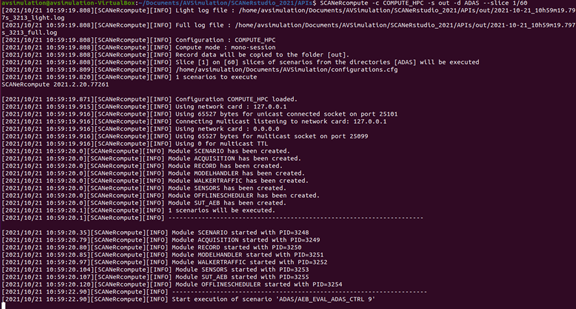

# Validate the new SCANeR workspace for Linux before running it on HPC

Performing local tests will confirm that you did not miss anything before running Massive a Simulation.  
It’s easy, simply run your test cases with SCANeR compute. 
To do so, run  
```
SCANeRcompute -c COMPUTE_HPC -s out -d ADAS --slice 1/60
```

We add the `--slice` argument to run only 1 test case, if one is running, that means that our SCANeR workspace is set up.  
Here are the results you should get:  

...  


Getting the result: `Execution is successful` means that you did a great job and you’re now ready for Massive Simulation!  

The method to run SCANeR compute on HPC architecture for Massive Simulation applications is the exact same 😊  

Here is a list of the remaining actions on your side: (we also offer services on demand to assist you with the deployment of SCANeR)
* SCANeR data has to be accessible on the machine where SCANeR compute is executed.
* Systems Under Test (SUT) as a Model in the Loop have to be accessible on the machine where SCANeR compute is executed.
* Organize, format and make results available to end-user(s). See next (and last) guide for SCANeR Analytics demo
* Manage job scheduling in cloud environment(s).

The SCANeR Standalone method supports all container solutions (e.g. Docker, Kubernetes).
Ask us for details 😉
