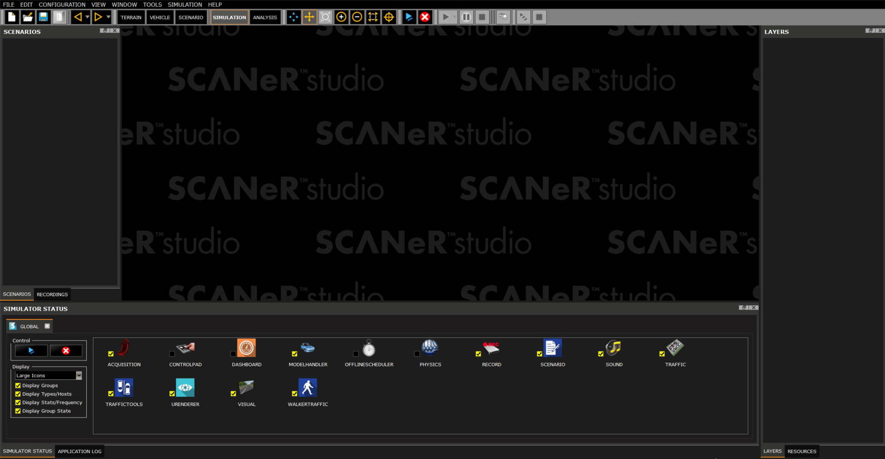

:arrow_left: [First launch](../HT_FirstLaunch/HT_FirstLaunch.md)

# How to navigate in SCANeR studio.

This guide explains how to navigate through the basic interfaces to be ready to run any simulation.

* Step 1. The different modes
* Step 2. The modules
* Step 3. Start ~~working~~ playing

## Step 1. The different modes

Once the software is launched, you will arrive in an interface with a toolbar. This is where you will find the 5 modes of SCANeR studio, each has specific features.

### TERRAIN

SCANeR TERRAIN mode enables to easily design 3D scenes for driving simulation.
It is especially designed to create more than a 3D synthetic environment because it automatically generates correlated databases: logical data needed by a driving simulator.
It means data for ego, actors (cars, trucks, pedestrian, etc.), topological and analytic levels (set and configure traffic signal timing, phases, vehicle paths at intersectionsroad sections and their interconnections, road profiles, etc.).

Key Features:
* Create environments
* Edit logical content, rolling surface (e.g. SOL, RDF, VS-TERRAIN, etc.), materials (e.g. BRDF, etc.) and surrounding environment
* Import GIS (e.g. HERE, TomTom, OSM, OpenDRIVE, etc.)
* Insert signs, signals, guardrails, road damage, buildings, etc.
* Generate 3D background.
* Etc.

There are differents ways to design a terrain depending of your project, time and budget:

* Design a terrain from an existing one (e.g. from our delivered default data set)
* Design a terrain from scracth
* Design a terrain from GIS import
* Ask us for a service of content creation. AVSimulation has developed its own methodology of terrain creation based on LiDAR acquisition for a high fidility rendering.

### VEHICLE

Thanks to SCANeR VEHICLE mode you'll be able to:
* Interface with SCANeR your favorite vehicle dynamics model (e.g. CarSim, Vi-CRT, CarMaker, etc.) to test and validate it or to use it to validate others systems as ADAS, etc.
* Edit CALLAS vehicle dynamics model. CALLAS is the advanced vehicle model of AVSimulation used into SCANeR. It is the premium model used for high-end driving simulators and automotive engineering. The level of detail and validation of this model enables a realistic driving experience when used in a simulator and can be used to develop, evaluate and validate vehicles and systems in an engineering environment. CALLAS covers a wide range of applications: truck, bus, cars, motorsport, machine, tractors, and military vehicles (such as tracked vehicles). 
* Preform offline simulation (thanks to SCANeR Virtual driver to emulate commands) with standard ISO vehicle dynamics tests

### SCENARIO

The Scenario mode has been designed to prepare the simulation. Choose a terrain, a vehicle to drive, add other vehicles, pedestrians, 3D objects, etc. Then manage events (thanks to a script editor) in order to create situations. Prepare the debriefing of exercises by defining data to be recorded.

SCANeR studio has libraries of terrains, vehicles, pedestrians, 3D objects and has a specific language to make elements interact together.

### SIMULATION

The Simulation mode is where you will run your simulation. Your simulation will use your own scenari or the default ones in the SCANeR studio libraries. The Simulation mode is made to monitor and control functions such as recorder, tracking, motion, sound, visual, etc. These functions are called modules.

### ANALYSIS

The Analysis mode is made to view again an exercise of a driving simulation and to extract information as charts, spreadsheet data or video.

# Step 2. The modules

As seen previously, the Simulation mode includes modules. The modules are used to define what capabilities the simulator has. For example, add MOTION module if a motion platform had to manage dynamic movements. There are a lot of pre-existing modules, the ones in the bottom section of the Simulation mode are just the ones present in the default configuration. You can also create your own modules through the SCANeR API.

# Step 3. Start ~~working~~ playing

**Congratulations!** Now that you know more about the different interfaces and how SCANeR studio works, it's time to start playing. But before you start anything, we strongly recommend that you create your own workspace. Don’t worry, everything is explained here: [HOW TO? Create a new Workspace in SCANeR Studio](https://github.com/AVSGuillaume/Samples-Pack/blob/Pages/Pages/HT_Create_custom_work_environment/HT_Create_A_New_Workspace.md) 

😊

:arrow_right: [Open an existing scenario](../HT_Open_a_scenario/HT_Open_a_scenario.md)
