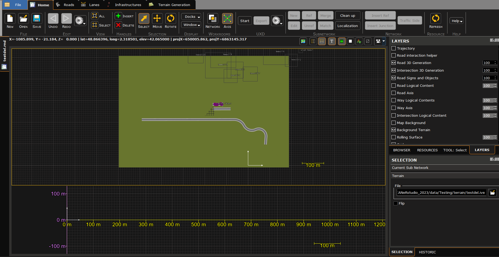
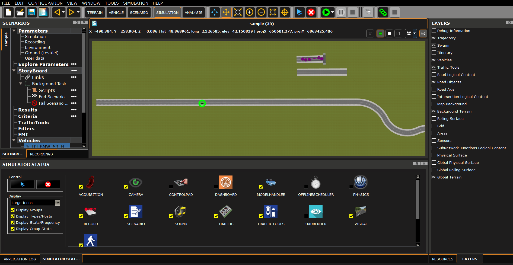
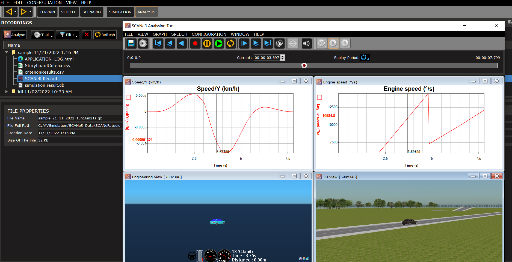

# How to navigate the user interface

This guide will explain how to navigate through the basic interfaces so you can be ready to run any simulation.

* Step 1. The different modes
* Step 2. The modules
* Step 3. Start ~~working~~ playing

## Step 1. The different modes

Once the software is launched, you will see an interface with a toolbar at the top of the window. This is where you will find the 5 modes of SCANeR studio, each with specific features.

### TERRAIN

SCANeR TERRAIN mode allows you to easily design 3D environments for driving simulation.
It is especially designed to create more than a 3D synthetic environment, as it automatically generates correlated databases: logical data needed by a driving simulator.
This means data for the ego vehicle, actors (cars, trucks, pedestrians, etc.), topological and analytic levels (set and configure traffic signal timing, phases, vehicle paths at intersections, road sections and their interconnections, road profiles, etc.).

Key Features:
* Create environments
* Edit logical content, rolling surface (e.g. SOL, RDF, VS-TERRAIN, etc.), materials (e.g. BRDF, etc.) and surrounding environment
* Import GIS (e.g. HERE, TomTom, OSM, OpenDRIVE, etc.)
* Insert objects, signs, signals, guardrails, road damage, buildings, etc.
* Generate 3D background.
* And more

There are different ways to design a terrain depending on your project, time and budget:

* Design a terrain from an existing one (e.g. from our delivered default data set)
* Design a terrain from scracth
* Design a terrain from GIS import
* Ask us for one of our content creation services. AVSimulation has developed its own methodology of terrain creation based on LiDAR acquisition for a high fidelity rendering.

### VEHICLE

With SCANeR VEHICLE mode you'll be able to:
* Integrate your favorite vehicle dynamics model into SCANeR (e.g. CarSim, Vi-CRT, CarMaker, etc.) to test and validate, or to use it to validate other systems such as ADAS, etc.
* Edit CALLAS vehicle dynamics models. CALLAS is AVSimulation's advanced vehicle model used in SCANeR. It is the premier model used for high-end driving simulators and automotive engineering. The level of detail and fidelity of this model enables a realistic driving experience when used in a simulator and can be used to develop, evaluate and validate vehicles and systems in an engineering environment. CALLAS covers a wide range of applications: trucks, buses, cars, motorsport, machines, tractors, and military vehicles (such as tracked vehicles). 
* Preform offline simulation (thanks to SCANeR Virtual driver to emulate commands) with standard ISO vehicle dynamics tests

### SCENARIO

The SCENARIO mode allows you to design your experimentation. Thanks to its user friendly graphical interface you'll be able to:
* Choose your terrain
* Define your Ego vehicle
* Select surrouding actors (e.g. cars, trucks, bicycles, pedestrians, etc.)
* Add traffic tools to automaticaly trigger events (e.g. add actors, situations, etc.)
* Prepare your custom metrics/KPIs
* And more

The SCANeR installer includes a rich default data set to help you begin, which includes terrains, vehicles, pedestrians, 3D objects, etc.

### SIMULATION

SCANeR Everywhere!
The SIMULATION mode enables you to supervise a simulation. Thanks to its advanced features you'll be able to manage the execution of the simulation by distributing its ressources on a single computer or across multiple computers (e.g. MiL, Sil, DiL), manage multi-driver simulations (e.g. DiL), or interface with a real-time target (e.g. for HiL, ViL applications), etc.
> Tips for SCANeR Everywhere? Indeed, thanks to the SCANeR product familly you'll also be able to run SCANeR on HPC configurations for Massive simulation applications, and on the cloud if needed with or without containers as a docker, etc. In fact there is no limit (except your imagination 😉). SCANeR is already deployed on Azure, Alibaba, AWS, etc.

In addition, with SIMULATION mode you'll be able to setup your simulator by defining its properties, such as:
* Image generator (e.g. screen, projector, VR/Headset, etc. with or without blending/warping solution)
* Cockpit
* Static or dynamic
* Audio
* Monitoring systems (e.g. eye tracker)

### ANALYSIS

The ANALYSIS mode is a complete tool which enables post-treatments of SCANeR outputs, but not only this 😊. Thanks to its graphical interface you'll also be able to review the entire simulation, compare simulations, etc. How? The Analysing Tool features allow you to view any type of recorded data, and it is all synchronized! For example:
* Graph (> export a graph directly to csv)
* Video
* Sound
* Specific engineering view for vehicle dynamics research
* And more

# Step 2. The modules

As seen previously, the SIMULATION mode includes modules. A module is a SCANeR program exchanging I/O with other SCANeR programs or third party software.
SCANeR official modules are used to define the simulator's capabilites. For example, add the MOTION module if a motion platform needs to manage dynamic movements. There are a lot of pre-existing modules; the ones in the bottom section of the Simulation mode are just the ones present in the default configuration.
> Tip: You can create your own modules with the SCANeR SDK 👍🏻.
> It is available in different programming languages, such as: C/C++, C#, Simulink, Python, LabVIEW, RTMaps, etc.

# Step 3. Start ~~working~~ playing

**Congratulations!** Now that you know more about the different interfaces and how SCANeR works, it's time to start playing 😊
