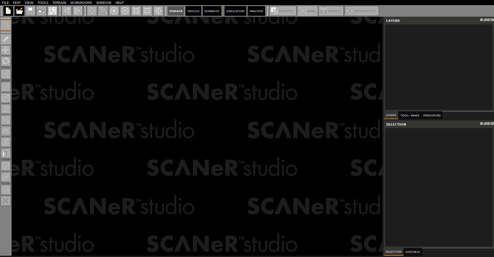
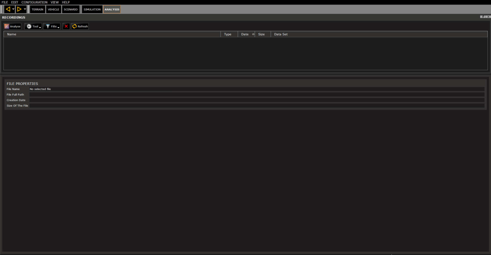

:arrow_left: [First launch](../HT_FirstLaunch/HT_FirstLaunch.md)

# How to navigate in SCANeR studio.

This guide explains how to navigate through the basic interfaces to be ready to run any simulation.

* Step 1. The different modes
* Step 2. The modules
* Step 3. Start ~~working~~ playing

## Step 1. The different modes

Once the software is launched, you will arrive in an interface with a toolbar. This is where you will find the 5 modes of SCANeR studio, each has specific features.

### TERRAIN

SCANeR TERRAIN mode enables to easily design 3D scenes for driving simulation.
It is especially designed to create more than a 3D synthetic environment because it automatically generates correlated databases: logical data needed by a driving simulator.
It means data for ego, actors (cars, trucks, pedestrian, etc.), topological and analytic levels (set and configure traffic signal timing, phases, vehicle paths at intersectionsroad sections and their interconnections, road profiles, etc.).

Key Features:
* Create environments
* Edit logical content, rolling surface (e.g. SOL, RDF, VS-TERRAIN, etc.), materials (e.g. BRDF, etc.) and surrounding environment
* Import GIS (e.g. HERE, TomTom, OSM, OpenDRIVE, etc.)
* Insert signs, signals, guardrails, road damage, buildings, etc.
* Generate 3D background.
* Etc.

There are differents ways to design a terrain depending of your project, time and budget:

* Design a terrain from an existing one (e.g. from our delivered default data set)
* Design a terrain from scracth
* Design a terrain from GIS import
* Ask us for a service of content creation. AVSimulation has developed its own methodology of terrain creation based on LiDAR acquisition for a high fidility rendering.

### VEHICLE

Thanks to SCANeR VEHICLE mode you'll be able to:
* Interface with SCANeR your favorite vehicle dynamics model (e.g. CarSim, Vi-CRT, CarMaker, etc.) to test and validate it or to use it to validate others systems as ADAS, etc.
* Edit CALLAS vehicle dynamics model. CALLAS is the advanced vehicle model of AVSimulation used into SCANeR. It is the premium model used for high-end driving simulators and automotive engineering. The level of detail and validation of this model enables a realistic driving experience when used in a simulator and can be used to develop, evaluate and validate vehicles and systems in an engineering environment. CALLAS covers a wide range of applications: truck, bus, cars, motorsport, machine, tractors, and military vehicles (such as tracked vehicles). 
* Preform offline simulation (thanks to SCANeR Virtual driver to emulate commands) with standard ISO vehicle dynamics tests

### SCENARIO

The SCENARIO mode enables to design your experimentation. Thanks to its user friendly graphical interface you'll be able to:
* Choose your terrain,
* Define your Ego vehicle,
* Select surrouding actors (e.g. cars, trucks, bicycle, pedestrian, etc.)
* Add traffic tools to automaticaly trigger events (e.g. add actors, situations, etc.)
* Prepare your custom metrics/KPI
* Etc.

SCANeR installer includes a rich default data set to help you to begin, it includes terrains, vehicles, pedestrians, 3D objects, etc.

### SIMULATION

SCANeR Everywhere!
The SIMULATION mode enables you to supervise a simulation. Thanks to its advanced features you'll be able to manage the execution of the simulation by distributing its ressources on a single computer or on multi-computers (e.g. MiL, Sil, DiL), or manage multi-driver simulations (e.g. DiL), interface with a real-time target (e.g. for HiL, ViL applications), etc.
> Tips, SCANeR Everywhere? Indeed, thanks to SCANeR product familly you'll also be capable to run SCANeR on HPC configuration for Massive simulation application, and on the cloud if needed with or without container as docker, etc. In fact there is no limit (except your imagination 😉). SCANeR is already deployed on Azure, Alibaba, AWS, etc.

In addition, thanks to SIMULATION mode you'll be able to setup your simulator by defining its properties as:
* Image generator (e.g. screen, projector, VR/Headset, etc. with or without blinding/warping solution)
* Cockpit
* Static or dynamics
* Audio
* Monitoring systems (e.g. eye tracker
* Etc.

### ANALYSIS

The ANALYSIS mode is a complete tool which enables post-treatments of SCANeR outputs but not only 😊. Thanks to its graphical interface you'll be able to review all the simulation, compare simulations, etc. How to? Analysing Tool features enable to view any type of recorded data and all synchronised! as:
* Graph (> export a graph directly to csv)
* Video
* Sound
* Specific engineering view for vehicle dynamics research
* Etc.

# Step 2. The modules

As seen previously, the SIMULATION mode includes modules. A module is a SCANeR program exchanging I/O with others SCANeR programs or third party software.
SCANeR official modules are used to define what capabilities the simulator has. For example, add MOTION module if a motion platform had to manage dynamic movements. There are a lot of pre-existing modules, the ones in the bottom section of the Simulation mode are just the ones present in the default configuration.
> Tips, Thanks to SCANeR SDK you can create your own modules 👍🏻.
> It is available in different programming language as: C/C++, C#, Simulink, Python, LabVIEW, RTMaps, etc.

# Step 3. Start ~~working~~ playing

**Congratulations!** Now that you know more about the different interfaces and how SCANeR works, it's time to start playing 😊

:arrow_right: [Open an existing scenario](../HT_Open_a_scenario/HT_Open_a_scenario.md)
