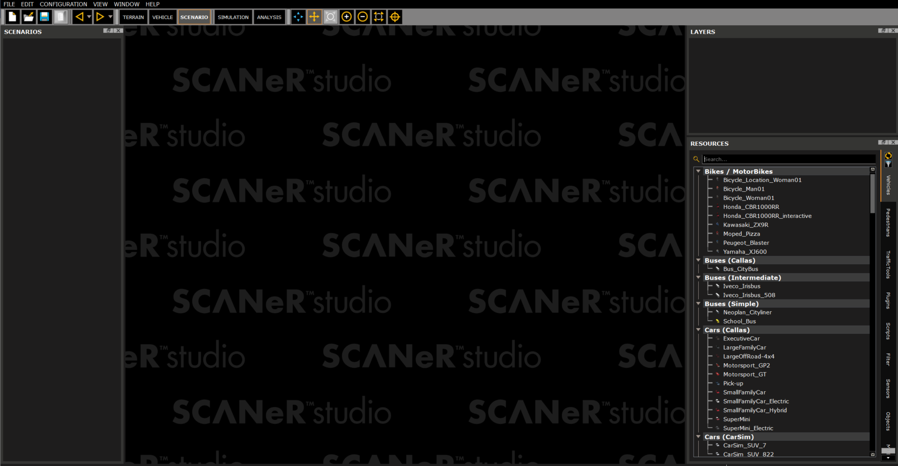

:arrow_left: [First launch](../HT_FirstLaunch/HT_FirstLaunch.md)

# How to navigate in SCANeR studio.

This guide explains how to navigate through the basic interfaces to be ready to run any simulation.

* Step 1. The different modes
* Step 2. The modules
* Step 3. Start ~~working~~ playing

## Step 1. The different modes

Once the software is launched, you will arrive in an interface with a toolbar. This is where you will find the 5 modes of SCANeR studio, each of which has specific functions.

### TERRAIN

The terrain mode has been made to easily build quickly a road network for driving simulation applications. It is especially designed to create more than a 3D synthetic environment because it automatically generates correlated databases: logical data needed by a driving simulator. It means data for vehicle dynamics, data for traffic vehicles (behaviour model), topological and analytic levels (road sections and their interconnections, curve parameters, profile descriptions (where lane parameters are stored), road signs and objects…).

There are several ways to build a terrain:

- Create the 3D terrain using Terrain mode of SCANeR studio. The interface allows the user to build a simple graphic definition of the road network. It is designed to be used by non-graphic designer users. The database (3D and data) is generated automatically.

- Import in the Terrain mode an existing 3D database (created by a computer graphic team) and use the Terrain interface to turn its database into a SCANeR studio compliant terrain.

### VEHICLE

The Vehicle Mode is the dynamic part of SCANeR studio software that analyses the behaviour of vehicles, in 3 dimensions, coupled and non-linear. It describes their behaviour until the limit of adhesion.

By default, several dynamics models are available in SCANeR studio, their complexity level depends on how they are used in the simulation. From a basic behaviour for surrounding traffic vehicles, to a complex high level dynamic model for the driven vehicle, or for vehicle dynamics engineering studies with Callas dynamic model.

External models can also be plugged into SCANeR studio.

### SCENARIO

The Scenario mode has been designed to prepare the simulation. Choose a terrain, a vehicle to drive, add other vehicles, pedestrians, 3D objects, etc. Then manage events (thanks to a script editor) in order to create situations. Prepare the debriefing of exercises by defining data to be recorded.

SCANeR studio has libraries of terrains, vehicles, pedestrians, 3D objects and has a specific language to make elements interact together.

### SIMULATION

The Simulation mode is where you will run your simulation. Your simulation will use your own scenari or the default ones in the SCANeR studio libraries. The Simulation mode is made to monitor and control functions such as recorder, tracking, motion, sound, visual, etc. These functions are called modules.

### ANALYSIS

The Analysis mode is made to view again an exercise of a driving simulation and to extract information as charts, spreadsheet data or video.

# Step 2. The modules

As seen previously, the Simulation mode includes modules. The modules are used to define what capabilities the simulator has. For example, add MOTION module if a motion platform had to manage dynamic movements. There are a lot of pre-existing modules, the ones in the bottom section of the Simulation mode are just the ones present in the default configuration. You can also create your own modules through the SCANeR API.

# Step 3. Start ~~working~~ playing

**Congratulations!** Now that you know more about the different interfaces and how SCANeR studio works, it's time to start playing. But before you start anything, we strongly recommend that you create your own workspace. Don’t worry, everything is explained here: [HOW TO? Create a new Workspace in SCANeR Studio](https://github.com/AVSGuillaume/Samples-Pack/blob/Pages/Pages/HT_Create_custom_work_environment/HT_Create_A_New_Workspace.md) 

😊

:arrow_right: [Open an existing scenario](../HT_Open_a_scenario/HT_Open_a_scenario.md)
