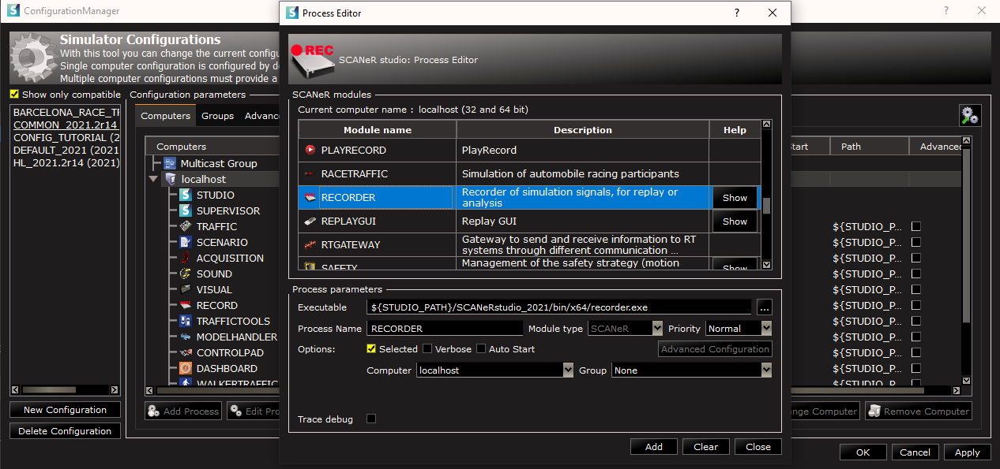
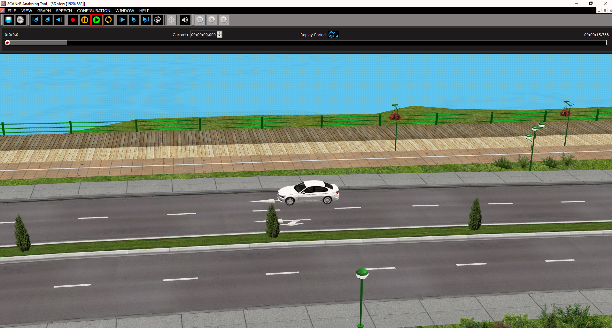
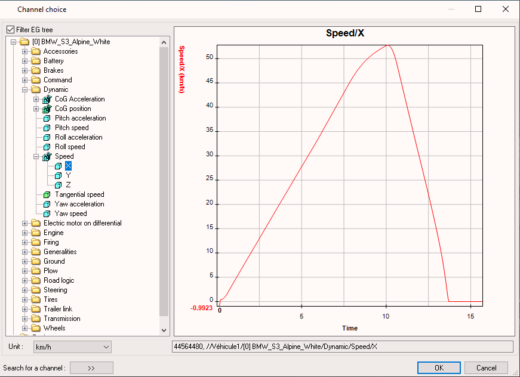

:arrow_right: [How to run a simulation: good practices](../HT_Run_a_simulation_good_practices/HT_Run_a_simulation_good_practices.md)

# How to replay a simulation

In SCANeR studio, the simulation is composed of `actors` (light vehicles, trucks, buses, motorbikes, pedestrians, etc...) performing actions according to a `scenario` that has been created by the user. Depending on the way you configure these `actors`, the simulation might not produce the same results each time you play it. This is why we developed a module called `Record`. This module, as its name says it, will record your simulation, and you will be able to replay it and extract data from the record itself.

> Note: With the Analyzing Tool, you will be able to create your own graphs, to correlate the exact data you want. But this will be for another guide that is coming soon 😉.

In this guide, I will explain how to record a simulation and replay it afterwards.

- Step 1. Add the `Record` module to your configuration and record a simulation
- Step 2. Replay the simulation
- Step 3. Extract a graph to a CSV file.

Let's jump into the guide!

## Step 1. Add the `Record` module to your configuration and record a simulation

1. Open SCANeR studio and select `SIMULATION` mode.

   

2. Open the `CONFIGURATION MANAGER` and click on `Add process`. Search for the `RECORDER` module and add it to the configuration.

   

3. Open a scenario you with to play, and start the `RECORD` module by double clicking on it. You can now play the simulation, and it will be recorded

   

## Step 2. Replay the simulation

1. Open `ANALYSIS` mode.

   

2. In this mode, you will see the list of recorded simulations for the current configuration. Double click on the record you want to replay.

   

3. You can now click on the `Play` button. The record will be played exactly as during the simulation.

   

4. You can use the slider on the top of the window to control the moment you want to analyze. You can also use the graphs to control the replay, by simply holding right click on the graph and sliding to the relevant value. In the next step we will see how to create the graph and export it.

## Step 3. Extract a graph to a CSV file.

1. Create a new graph by going in the `GRAPH` menu and selecting `New graph`.

   

2. A window will appear and you will be able to select the data you want to visualize. In my case, I am going to extract the speed of the vehicle under test. You can find this data under `Dynamic`->`Speed` and you have to choose the axis. When you click on `OK` the graph will appear in the analyzing tool and you will be able to move and rescale the windows.

   

3. In order to extract the graph you have to select its window, and in the `GRAPH` menu select `Current graph`->`Export to CSV`.

   

Congratulations! You now know how to record a simulation, replay it, and export data from it! 👍

:arrow_right: [Intermadiate guides](../../index.md#intermediate)
