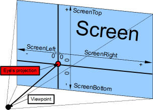

# How to? Configure the visual rendering

SCANeR studio is able to render the simulated scene on many display configuration, including single or multiple screens, projection system or head-mounted display.

This guide helps you configure the visual rendering for your display system.

* Important considerations
* Step 1. Add a new visual module
* Step 2. Initiate the configuration
* Step 3. View geometry
* Step 4. Quality VS performance
* Go further (advanced guide)

## Important considerations

### Rendering engines

In SCANeR studio it is possible to render using *Open Scene Graph* and *Unreal* rendering engines.  
The current guide is for *Open Scene Graph*.

### Hierarchy

Visual rendering has three levels of hierarchy:
* *Visual Module*: Defined by one instance of the *Visual.exe* executable. One Visual Module runs on one graphic processing unit (GPU).
* *Visual Pipe*: Defined by a rendering window on screen. Each *Visual Module* can handle several *Visual Pipes*.
* *Visual Channel*: Defined by a rendering sub-surface on the window. Each *Visual Pipe* can handle several *Visual Channels*.

### Performance

We recommend using one *Visual Module* per *GPU*.

One *Visual Module* can handle multi-windows (and therefore multi-displays) thanks to *Visual Pipes*.  
This is useful for mirror displays, because they are usually smaller and lower resolution ; several of them can be handled by a single GPU.  
However for high definition, high framerate displays, one GPU will not be able to handle more than one. In this case, use one *Visual Module* per display with the matching amount of GPUs.

### License

One *Visual License* is required for each *Visual Module* (i.e. each *GPU* as per our recommendation).
* *Foundation Pack* includes one *Visual License*

Additional *Visual Licenses* can be acquired as options:
* *Additional Visual* includes one *Visual License*
* *Additional Driver* includes one *Visual License*

## Step 1. Add a new visual module

The visual rendering of the simulation is managed by the module "Visual.exe", usually called "VISUAL" when creating a new [SCANeR configuration](../HT_Create_custom_work_environment/HT_Create_A_New_Workspace.html).

In order to have your own visual module configuration, start by [adding a new visual module in your configuration](../HT_Add_module/Add_module.md)*.
* The *executable* of the module should be `${STUDIO_PATH}/SCANeRstudio_2021/bin/x64/visual.exe`
* The *process name* of the module is your choice.
  Prefer capitalized names without white space.
  For clarity, start with "VISUAL_" followed by the name of your simulator, work station or display system.
* The *configuration file* can be any text file. We recommand using the default name `observer.cfg`, or at least one that starts with `observer...`.
> **Tip:** In the *Process Editor*, click *VISUAL* in the list of SCANeR modules in order to pre-fill the process parameters. Then adjust to your liking.


## Step 2. Initiate the visual configuration

In the *Process Editor*, click the file icon  in front of the configuration file in order to open and edit it.

> **Note:** If you are using a new file, start by copy-pasting the contents from `SCANeRstudio_2021/data/DEFAULT/observer.cfg`.

The file is divided in sections.
```
[Common]
; settings that will be applied to all visual modules using that use this configuration file.

[VISUAL]
; settings that will be applied to the visual module called "VISUAL"
[VISUAL:1]
; settings that will be applied to the pipe #1 of "VISUAL"
[VISUAL:1.1]
; settings that will be applied to the channel #1 of pipe #1 of "VISUAL"

; [...]
```

Unless a setting is defined in a lower hierarchy level, the value is inherited from higher level of hierarchy.  
`[Common]` > `[VISUAL]` > `[VISUAL:1]` > `[VISUAL:1.1]`

Below the existing sections, create new sections that matches your own visual module name.
```
; [...]

[VISUAL_SHOWSIM]
NbPipes			= 1
VehicleId		= 0

[VISUAL_SHOWSIM:1]
NbChannels		= 1

[VISUAL_SHOWSIM:1.1]

; [...]
```
Here the first settings are added:
* *NbPipes = 1*: There is only one visual pipe.
* *VehicleId = 0*: The view will track the "ego" vehicle (of ID 0)
* *NbChannels = 1*: There is only one channel in the first pipe.

## Step 3. View geometry

### On screen rectangle

The *Visual Pipe* draws the window on screen. By default, it is a borderless rectangle. The rectangle geometry is set by two parameters:
* *Position*: The coordinates of the *bottom left* corner in pixels, from the *bottom left* corner of the screen.
* *Resolution*: The size in pixels.

So in order to cover a Full HD display, use the following settings:
```
[VISUAL_SHOWSIM:1]
Position    = 0 0
Resolution  = 1920 1080
;[...]
```

### Field of view

The *Visual Channel* describes the field of view by the screen geometry relative to the eye:
* *ScreenDist*: The distance between the human driver's eye and the display.
* *ScreenTop*, *ScreenBottom*, *ScreenLeft*, *ScreenRight*: The display border positions relative to the human driver's eye position.



In principle the settings values should be the result of measurement on the actual displays, or from the simulator's CAD.

1. Define the horizontal FOV from measurement or CAD.
2. Compute the vertical FOV to apply.

Doing so ensures that the aspect ratio of the screen (e.g. 16:9) is respected.

Example measurements:
* Screen distance is measured at 2.0 meters
* Horizontal FOV is measured at 30 degrees

Computations:
* ScreenLeft = `tan( FOV ) / ScreenDist` = `tan( 30 ) / 2.0` = `0.28868`
* ScreenTop = `tan( FOV ) / ScreenDist / ScreenRatio` = `tan( 30 ) / 2.0 / (16:9)` = `0.16238`

```
[VISUAL_SHOWSIM:1.1]
ScreenDist    = 2.0
ScreenTop     = 0.16238
ScreenBottom  = -0.16238
ScreenRight   = 0.28868
ScreenLeft    = -0.28868
```

## Step 4. Quality VS performance

## Go further

Congratulations for setting your first custom Visual!
If you want to go further and add mirrors and multi-screens, check the [Advanced visual rendering configuration guide](./HT_configure_visual_advanced.md)*

